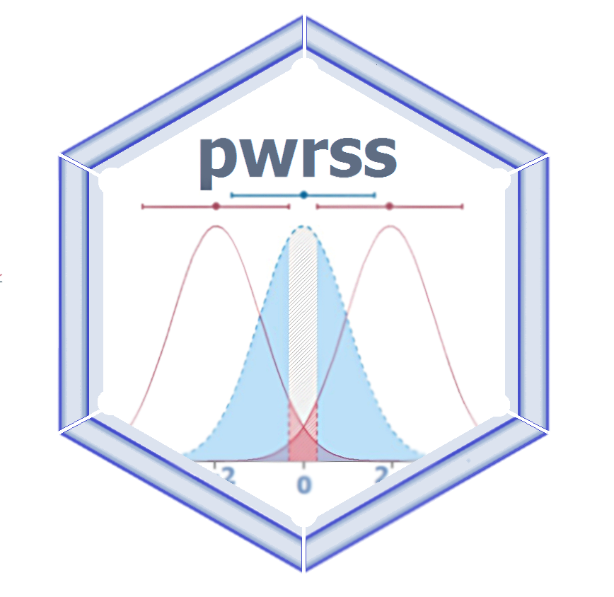

<h2> Statistical Power and Sample Size Calculation Tools </h2>

:::: {style="display: flex;"}

::: {}
To install, load, and use pwrss in R:  
`install.packages("pwrss")`   
`library(pwrss)`  

</img>
:::

::: {}

&nbsp;

:::

::: {}
Alternatively calculations can be performed using links below: 

| Language | User Interface |
|:----------|:---------------|
| English  | [https://pwrss.shinyapps.io/index/](https://pwrss.shinyapps.io/index/) |
| English  | [https://pwrss.shinyapps.io/lang-en/](https://pwrss.shinyapps.io/lang-en/) |
| Turkish  | [https://pwrss.shinyapps.io/lang-tr/](https://pwrss.shinyapps.io/lang-tr/) |

[</img>](https://pwrss.shinyapps.io/index/)

:::

::::

pwrss R package allows statistical power and minimum required sample size calculations for 

  - `(1)` testing a proportion (one-sample) against a constant, 
  - `(2)` testing a mean (one-sample) against a constant,  
  - `(3)` testing difference between two proportions (independent samples),
  - `(4)` testing difference between two means/groups (parametric and non-parametric tests for independent and paired samples),
  - `(5)` testing a correlation (one-sample) against a constant,  
  - `(6)` testing difference between two correlations (independent samples),
  - `(7)` testing a coefficient (with standardized or unstandardized coefficients, with no covariates or covariate adjusted) in multiple linear regression, logistic regression, and Poisson regression,
  - `(8)` testing an indirect effect (with standardized or unstandardized coefficients, with no covariates or covariate adjusted) in the mediation analysis (Sobel, Joint, and Monte Carlo),
  - `(9)` testing an R-squared against zero in linear regression 
  - `(10)` testing an R-squared difference against zero in hierarchical regression
  - `(11)` testing an eta-squared or f-squared (for main and interaction effects) against zero in analysis of variance (ANOVA) (could be one-way, two-way, and three-way), 
  - `(12)` testing an eta-squared or f-squared (for main and interaction effects) against zero in analysis of covariance (ANCOVA) (could be one-way, two-way, and three-way), 
  - `(13)` testing an eta-squared or f-squared (for between, within, and interaction effects) against zero in one-way repeated measures analysis of variance (RM-ANOVA) (with non-sphericity correction and repeated measures correlation),
  - `(14)` testing goodness-of-fit or independence for contingency tables.  
  Alternative hypothesis can be formulated as "not equal", "less", "greater",  "non-inferior", "superior", or "equivalent" in `(1)`, `(2)`, `(3)`, and `(4)`; as "not equal", "less", or "greater" in `(5)`, `(6)`, `(7)` and `(8)`; but always as "greater" in `(9)`, `(10)`, `(11)`, `(12)`, `(13)` and `(14)`. 
  
  
**If you find the package and related material useful please cite as:**

- Bulus, M. (2023). pwrss: Statistical Power and Sample Size Calculation Tools. R package version 0.3.1. https://CRAN.R-project.org/package=pwrss

- Bulus, M., & Polat, C. (in press). pwrss R paketi ile istatistiksel guc analizi [Statistical power analysis with pwrss R package]. Ahi Evran Universitesi Kirsehir Egitim Fakultesi Dergisi. https://osf.io/ua5fc/download/

